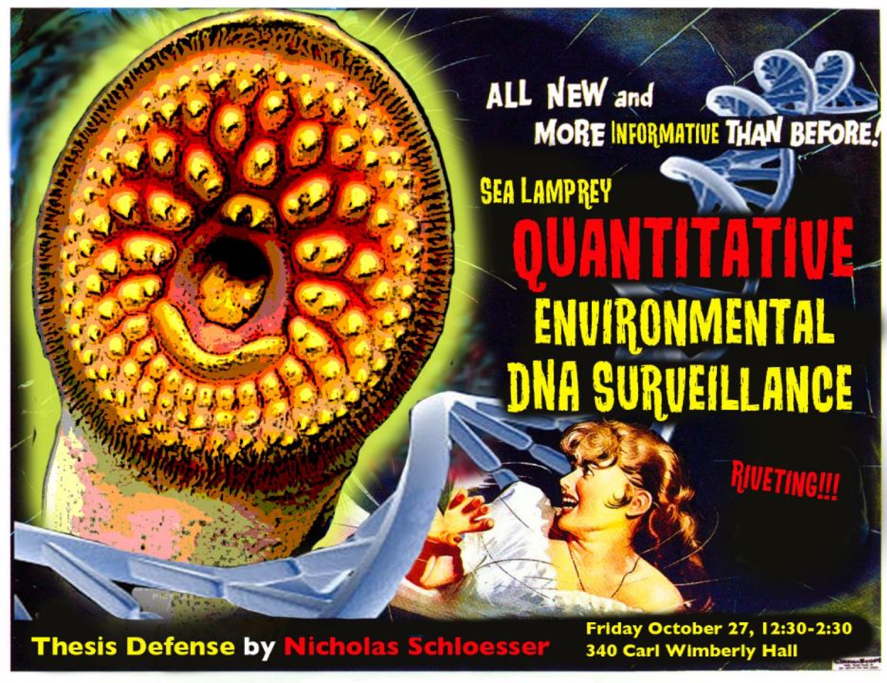
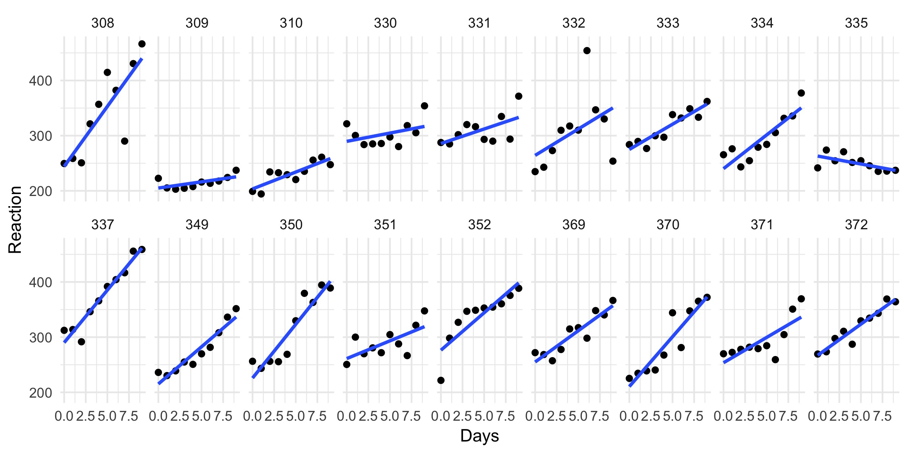

Hierarchical and mixed-effect models in R
========================================================
author: Richard Erickson
date: 1 May 2019
autosize: true
css: css/style.css
font-import: http://fonts.googleapis.com/css?family=Open+Sans
font-family: 'Open Sans'
transition: none
   
<span class="footer">
U.S. Department of the Interior<br>
U.S. Geological Survey 
</span>

<!-- TO DO: -->
<!-- - Find GLMER Example dataset  -->
<!-- - Complete case study  -->
<!-- - Go through materials once  -->

About me
========================================================
title: true
incremental: true

- Research Quantitative Ecologist 
- Develop models to guide invasive species control
- *De facto* consulting statistician  
- *UseR* since 2007

<span class="footer">
  
</span>

Learning outcomes
========================================================
title: true
incremental: true

- Understand basics of mixed-effect models
- Know how to use lme4's `lmer()` and `glmer()` functions
- Awareness of advanced methods

Outline
========================================================
title: true
incremental: true

- Intro (5 minutes)
- Why do we need hierarchical or mixed-effect models? (5 minutes)
- Refresher on linear models (20 minutes)
- What are hierarchical or mixed-effect? (30 minutes)
- Linear mixed-effect models with `lme4` (60 minutes)
- Generalized mixed-effect models with `lme4` (45 minutes)
- Beyond simple models: Where to go from here? (45 minutes)

<span class="footer">
  
</span>

Why do we need hierarchical models?
========================================================
title: true


<span class="footer">
  
</span>

pseudo-replication
========================================================
title: true


<span class="footer">
  
</span>


Nested data
========================================================
title: true


<span class="footer">
  
</span>


Repeated measures
========================================================
title: true


<span class="footer">
  
</span>


Linear models: Workhorse of R
========================================================
title: true


Image source: Library of Congress

<span class="footer">
  
</span>


Simple linear model
========================================================
title: true
incremental: true

- $y = ax + b$
- $y = a + b x$
- $y = m x + b$
- $y_i \sim \beta_0 + \beta_1 x_i + \epsilon_i, ~\epsilon_i \sim \text{N}(0,\sigma)$

<span class="footer">
  
</span>


lm() in R
========================================================
title: true
incremental: true

- `lm()`
- `forumla = `
- `data = `
- `lm(formula - y~ x, data = dat)`

<span class="footer">
  
</span>

Multiple regression
========================================================
title: true
incremental: true

- $y \sim x_1 \beta_1 +  x_2 \beta_2 + \epsilon_i$
- `lm(y ~ x1 + x2, data = dat)`

<span class="footer">
  
</span>


Dummy variables
========================================================
title: true
incremental: true

- Continuous (*slope*): 
  - The vector of raw data
  - `x1` = c(`1.1361855, -0.7531031, -1.1202502, 0.0732998`)
- Discrete (*intercept*):
  - `0`s and `1`s to code for membership in a group
  - `x2` = c(`0, 0, 0, 0`)
- "Coefficients" rather than "slopes" or "intercepts" 

<span class="footer">
  
</span>

Formula syntax
========================================================
title: true
incremental: true


- Global intercept with differences:
  - `formula = y ~ 1 + x1` 
  - (or shorthand `formula = y ~ x1`)
- Intercept for each group:
  - `formula = y ~ x1 - 1`

<span class="footer">
  
</span>

Underlying and guiding theory
========================================================
title: true
incremental: true

- Linear combinations of variables to explain and predict
- Additive with intercepts
- Multiplicative with slopes
- Peter Delgard's [Introductory Statistics with R](https://www.springer.com/us/book/9780387790534) 
- Frank Harell's [Regression Modeling Strategies](http://biostat.mc.vanderbilt.edu/wiki/Main/RmS)


<span class="footer">
  
</span>

Demonstrate intercepts options
========================================================
title: true
incremental: true

- Red fish vs. blue fish length
- Red fish and blue fish length


<span class="footer">
  
</span>


Red fish, blue fish
========================================================
title: true


```r
df = data.frame(length = c(1, 2, 3), 
                fish = c("red", "blue", "red"))
print(df)
```

```
  length fish
1      1  red
2      2 blue
3      3  red
```


<span class="footer">
  
</span>

Red fish vs. blue fish
========================================================
title: true


```r
model.matrix( ~ length + fish, data = df)
```

```
  (Intercept) length fishred
1           1      1       1
2           1      2       0
3           1      3       1
attr(,"assign")
[1] 0 1 2
attr(,"contrasts")
attr(,"contrasts")$fish
[1] "contr.treatment"
```


<span class="footer">
  
</span>

Red fish and blue fish
========================================================
title: true


```r
model.matrix( ~ length + fish - 1, data = df)
```

```
  length fishblue fishred
1      1        0       1
2      2        1       0
3      3        0       1
attr(,"assign")
[1] 1 2 2
attr(,"contrasts")
attr(,"contrasts")$fish
[1] "contr.treatment"
```

<span class="footer">
  
</span>


Red fish, blue fish data
========================================================
title: true


```r
glimpse(fishes)
```

```
Observations: 20
Variables: 2
$ length <dbl> 8.792934, 10.277429, 11.084441, 7.654302, 10.429125, 10.5…
$ fish   <chr> "red", "red", "red", "red", "red", "red", "red", "red", "…
```

<span class="footer">
  
</span>


Red fish, blue fish summary
========================================================
title: true


```r
fish_summary <- fishes %>% group_by(fish) %>% summarize(mean(length))
fish_summary
```

```
# A tibble: 2 x 2
  fish  `mean(length)`
  <chr>          <dbl>
1 blue            4.88
2 red             9.62
```

<span class="footer">
  
</span>

Red fish, blue lm
========================================================
title: true


```r
fish_lm <- lm(length ~ fish - 1, data = fishes)
print(coef(fish_lm),  digits = 3)
```

```
fishblue  fishred 
    4.88     9.62 
```

```r
print(fish_summary)
```

```
# A tibble: 2 x 2
  fish  `mean(length)`
  <chr>          <dbl>
1 blue            4.88
2 red             9.62
```
<span class="footer">
  
</span>


What if nested observations?
========================================================
title: true
incremental: true

Multiple fish per tank? 

- Collapse
  - Use means by group
  - Lose variability, observations
- Ignore 
  - Treat all individuals as independent
  - Too many observations ("pseudo-replication")
- Model it! 


<span class="footer">
  
</span>

Linear mixed-effect models
========================================================
title: true
incremental: true

- Assume hierarchy of data 
- Grouping of error terms
- Allow for shared mean of means
- $y_i \sim \beta_0 + \beta_1 x_i + \epsilon_{i},~\epsilon_{i} \sim \text{N}(0, \sigma)$
- $y_i \sim \beta_0 + \beta_1 x_i + \epsilon_{i} + \delta_{i,j},~\epsilon_{i} \sim \text{N}(0, \sigma),~\delta_{i,j} \sim \text{N}(0, \sigma_j)$


<span class="footer">
  
</span>


Brief history
========================================================
title: true
incremental: true

- Paired t-test, early 1900s
- 1940s and 1950s for repeated measure ANOVAs
- LMERs and GLMERs, 1990s and 2000s

<span class="footer">
  
</span>

Schools example
========================================================
title: true


<span class="footer">
  
</span>

Terminology 
========================================================
title: true
incremental: true


Multiple definitions (see Gelman's blog [post](https://statmodeling.stat.columbia.edu/2005/01/25/why_i_dont_use/))
- Hierarchical models, nested models, multi-level models
- Regression framework: 
  - "Pool" information
  - "Random-effect" vs. "fixed-effect" in "mixed-effect"
  - Linear mixed-effect regression (`lmer()`)
- Repeated sampling
  - Repeated-measure
  - Paired-test
 
<span class="footer">
  
</span>


Simple example for intercepts
========================================================
title: true


<span class="footer">
  
</span>


Fixed vs random-effect model
========================================================
title: true


<span class="footer">
  
</span>

Fixed vs random-effect model
========================================================
title: true


<span class="footer">
  
</span>


Applies to all coefficients
========================================================
title: true
incremental: true

- Random-effect intercept estimates
- Random-effect slope estimates 

<span class="footer">
  
</span>


Packages in R
========================================================
title: true
incremental: true

- Over a dozen R packages (see [here](http://glmm.wikidot.com/software) and [here](https://www.seascapemodels.org/rstats/2017/04/14/glmm-comparison.html))
- `lme4`

<span class="footer">
  
</span>

Example dataset
========================================================
title: true
incremental: false





Sea lamprey data details 
========================================================
title: true
incremental: true

- [Nick Schloesser](https://www.usgs.gov/staff-profiles/nicholas-schloesser?qt-staff_profile_science_products=3#qt-staff_profile_science_products)
- [code.usgs.gov](code.usgs.gov) points to [Sciencebase](https://www.sciencebase.gov/catalog/item/59b6cc06e4b08b1644ddf8b3)

 

<span class="footer">
  
</span>


Read in dataset 
========================================================
title: true


```r
library(tidyverse)
lamprey <- read_csv("./data/lamprey_adult_lab_DNA.csv")
head(lamprey)
```

```
# A tibble: 6 x 6
  Sample  Fluor  Copies Inhibited tank  stock
  <chr>   <chr>   <dbl> <chr>     <chr> <chr>
1 200L-2A FAM   1336000 NO        2A    200L 
2 200L-2B FAM   1099000 NO        2B    200L 
3 200L-2C FAM   1229000 NO        2C    200L 
4 200L-3A FAM   1827000 NO        3A    200L 
5 200L-3B FAM   1758000 NO        3B    200L 
6 200L-3C FAM   1543000 NO        3C    200L 
```

<span class="footer">
  
</span>

Reformat dataset
=======================================================
title: true


```r
lamprey <- lamprey %>% 
           mutate(Copies_2 = ifelse(is.na(Copies), log10(0 + 1), log10(Copies + 1)),
                  stock = factor(stock, levels = c("0L", "2L", "20L", "200L")))
```

<span class="footer">
  
</span>

Nested design 
========================================================
title: true


```r
lamprey %>%
  group_by(tank, stock) %>%
  summarise(n()) %>% print(n = 4)
```

```
# A tibble: 36 x 3
# Groups:   tank [9]
  tank  stock `n()`
  <chr> <fct> <int>
1 1A    0L        4
2 1A    2L        4
3 1A    20L       4
4 1A    200L      4
# … with 32 more rows
```

<span class="footer">
  
</span>

Plotting dataset
========================================================
title: true


<span class="footer">
  
</span>


lme4 
========================================================
title: true
incremental: true

- Bates et al. 2015
- `lmer()` function
- Similar to `lm()`


<span class="footer">
  
</span>


lmer() inputs
========================================================
title: true
incremental: true

- `formula = `
- `data = `

<span class="footer">
  
</span>


lmer() inputs, advanced 
========================================================
title: true
incremental: true

Optional, mainly debugging

- `REML = `
 - `TRUE`: Restricted maximum-likelihood, better for random-effect variances
 - `FALSE`:  Maximum-likelihood, better for fixed-effect estimates
- `control =` List of optional control settings
- `start` Initial values for numerical model fitting

<span class="footer">
  
</span>

lmer() formula
========================================================
title: true
incremental: true

- Random-intercept: 
  
    y ~ 1 + (1/group)
    
    
- Correlated random intercept and slope: 

    y ~ x + (x|group)
    
    
- Uncorrelated random intercept and slope: 

    y ~ x + (x||group)


<span class="footer">
  
</span>


lmer() example
========================================================
title: true


```r
lamprey_lmer <- 
  lmer(formula = Copies_2 ~ stock + (1|tank), 
       data = lamprey)
```

<span class="footer">
  
</span>


lmer print()
========================================================
title: true


```r
print(lamprey_lmer)
```

```
Linear mixed model fit by REML ['lmerMod']
Formula: Copies_2 ~ stock + (1 | tank)
   Data: lamprey
REML criterion at convergence: 219.0561
Random effects:
 Groups   Name        Std.Dev.
 tank     (Intercept) 0.02272 
 Residual             0.50222 
Number of obs: 144, groups:  tank, 9
Fixed Effects:
(Intercept)      stock2L     stock20L    stock200L  
     0.2576       3.3355       4.6871       5.9000  
```

<span class="footer">
  
</span>


lmer summary()
========================================================
title: true


```r
summary(lamprey_lmer)
```


<span class="footer">
  
</span>


lmer summary() part 1
========================================================
title: true

    Linear mixed model fit by REML ['lmerMod']
    Formula: Copies_2 ~ stock + (1 | tank)
       Data: lamprey
    
    REML criterion at convergence: 219.1
    
    Scaled residuals: 
        Min      1Q  Median      3Q     Max 
    -9.8295 -0.4390  0.0487  0.3301  1.3166 


<span class="footer">
  
</span>

lmer summary() part 2
========================================================
title: true

    Random effects:
     Groups   Name        Variance  Std.Dev.
     tank     (Intercept) 0.0005161 0.02272 
     Residual             0.2522290 0.50222 
    Number of obs: 144, groups:  tank, 9
    
    Fixed effects:
                Estimate Std. Error t value
    (Intercept)  0.25765    0.08405   3.066
    stock2L      3.33548    0.11838  28.177
    stock20L     4.68710    0.11838  39.595
    stock200L    5.89999    0.11838  49.841


<span class="footer">
  
</span>

lmer summary() part 3
========================================================
title: true

    Correlation of Fixed Effects:
              (Intr) stck2L stc20L
    stock2L   -0.704              
    stock20L  -0.704  0.500       
    stock200L -0.704  0.500  0.500


<span class="footer">
  
</span>


lmer fixef()
========================================================
title: true


```r
fixef(lamprey_lmer)
```

```
(Intercept)     stock2L    stock20L   stock200L 
  0.2576485   3.3354850   4.6870951   5.8999891 
```

<span class="footer">
  
</span>


lmer randef()
========================================================
title: true


```r
ranef(lamprey_lmer)
```

```
$tank
     (Intercept)
1A  0.0027312629
1B  0.0045587478
1C -0.0081302068
2A -0.0021005547
2B  0.0032970324
2C  0.0032203205
3A -0.0030643400
3B  0.0005770761
3C -0.0010893383
```

<span class="footer">
  
</span>

lmer confint()
========================================================
title: true


```r
confint(lamprey_lmer)
```

```
                 2.5 %    97.5 %
.sig01      0.00000000 0.1670263
.sigma      0.44268295 0.5589221
(Intercept) 0.09458184 0.4207152
stock2L     3.10496916 3.5660008
stock20L    4.45657931 4.9176110
stock200L   5.66947328 6.1305049
```

<span class="footer">
  
</span>

broom::tidy() option?
========================================================
title: true
incremental: true

- No, removed from broom
- [broom.mixed](https://cran.r-project.org/web/packages/broom.mixed/index.html) package
- Not included, previous stability issues

<span class="footer">
  
</span>

lmer predict()
========================================================
title: true


```r
predict(lamprey_lmer) %>% head()
```

```
       1        2        3        4        5        6 
6.155537 6.160935 6.160858 6.154573 6.158215 6.156548 
```
<span class="footer">
  
</span>

Understanding outputs 
========================================================
title: true
incremental: true

- Look at coefficients
- Increasing eDNA amount based upon stocking
- eDNA holds promise to measure lamprey density 

<span class="footer">
  
</span>

p-values?
========================================================
title: true
incremental: true

- "Users are often surprised and alarmed that the summary of a linear
mixed model fit by lmer provides estimates of the fixed-effects
parameters, standard errors for these parameters and a t-ratio but no
p-values..." [Doug Bates on R-help](https://stat.ethz.ch/pipermail/r-help/2006-May/094765.html)

- [Moving to a World Beyond “p < 0.05”](https://www.tandfonline.com/doi/full/10.1080/00031305.2019.1583913)

- Add-on packages exist (e.g,. lmerTest)

<span class="footer">
  
</span>


Random-effect slopes
========================================================
title: true
incremental: true

- Similar concept to intercepts
- Reduces impact of outliers
- Can help with small sample size


<span class="footer">
  
</span>


Example data
========================================================
title: true
 

```r
data(sleepstudy)
```




<span class="footer">
  
</span>


Random-effect slope
========================================================
title: true


```r
sleep_lmer <- 
  lmer(Reaction ~ Days + (Days|Subject), 
       data = sleepstudy)
```

<span class="footer">
  
</span>


sleepstudy summary 
========================================================
title: true


```r
summary(sleep_lmer)
```

<span class="footer">
  
</span>

sleepstudy summary out 1/3
========================================================
title: true

    Linear mixed model fit by REML ['lmerMod']
    Formula: Reaction ~ Days + (Days | Subject)
       Data: sleepstudy
    
    REML criterion at convergence: 1743.6
    
    Scaled residuals: 
        Min      1Q  Median      3Q     Max 
    -3.9536 -0.4634  0.0231  0.4634  5.1793 

<span class="footer">
  
</span>

sleepstudy summary out 2/3
========================================================
title: true

    Random effects:
     Groups   Name        Variance Std.Dev. Corr
     Subject  (Intercept) 612.09   24.740       
              Days         35.07    5.922   0.07
     Residual             654.94   25.592       
    Number of obs: 180, groups:  Subject, 18


<span class="footer">
  
</span>

sleepstudy summary out 3/3
========================================================
title: true

    Fixed effects:
                Estimate Std. Error t value
    (Intercept)  251.405      6.825  36.838
    Days          10.467      1.546   6.771
    
    Correlation of Fixed Effects:
         (Intr)
    Days -0.138


<span class="footer">
  
</span>


Using random-effects
========================================================
title: true
incremental: true

- Extract `fixef()`
- Extract `ranef()`
- Add `fixef()` to `ranef()`

<span class="footer">
  
</span>


Extract regression coefficients-code
========================================================
title: true


```r
subject_fixed <- matrix(rep(as.vector(fixef(sleep_lmer)), 
                            times = sleepstudy%>%pull(Subject) %>% 
                              unique() %>% 
                              length()),
                        ncol = 2, byrow = TRUE)
subject_coef <- ranef(sleep_lmer)$Subject + subject_fixed 
```

<span class="footer">
  
</span>


Extract regression coefficients-code output
========================================================
title: true


```r
subject_coef %>% head(.)
```

```
    (Intercept)      Days
308    253.6637 19.666258
309    211.0065  1.847583
310    212.4449  5.018406
330    275.0956  5.652955
331    273.6653  7.397391
332    260.4446 10.195115
```

<span class="footer">
  
</span>

Compare to linear model
========================================================
title: true


```r
sleep_lm <- lm(Reaction ~ Days * Subject - 1, 
               data = sleepstudy)
lm_coef <- tibble(
  name = names(coef(sleep_lm)[2:19]),
  intercept = coef(sleep_lm)[2:19],
  slope = c(coef(sleep_lm)[1],
            coef(sleep_lm)[1] + 
              coef(sleep_lm)[20:36]))
```

<span class="footer">
  
</span>

Compare methods 
========================================================
title: true


```r
lm_coef %>% head()
```

```
# A tibble: 6 x 3
  name       intercept slope
  <chr>          <dbl> <dbl>
1 Subject308      244. 21.8 
2 Subject309      205.  2.26
3 Subject310      203.  6.11
4 Subject330      290.  3.01
5 Subject331      286.  5.27
6 Subject332      264.  9.57
```

```r
subject_coef %>% head(.)
```

```
    (Intercept)      Days
308    253.6637 19.666258
309    211.0065  1.847583
310    212.4449  5.018406
330    275.0956  5.652955
331    273.6653  7.397391
332    260.4446 10.195115
```

<span class="footer">
  
</span>

Plot comparing methods
========================================================
title: true


<span class="footer">
  
</span>


Use predict to compare lines
========================================================
title: true


```
  Reaction Days Subject  predict
1 249.5600    0     308 253.6637
2 258.7047    1     308 273.3299
3 250.8006    2     308 292.9962
4 321.4398    3     308 312.6624
5 356.8519    4     308 332.3287
6 414.6901    5     308 351.9950
```

<span class="footer">
  
</span>

Code to compare lmer vs lm
========================================================


```r
sleee_2 <- ggplot(sleepstudy, aes(x = Days, y = Reaction)) + 
  geom_point() + facet_wrap(~ Subject, nrow = 2) + 
  stat_smooth(method = 'lm', se = FALSE, size = 2) +
  geom_line(aes(x = Days, y = predict), color = 'red', size = 2)
ggsave("./images/sleep_2.jpg", width = 8, height = 4)
```

<span class="footer">
  
</span>

Plot example 
========================================================


<span class="footer">
  
</span>

Thought experiment? How do we predict?
========================================================
title: true
incremental: true

- What do we do if we have a known group?
- What do we do if we are missing a group?
- Points towards another method...

<span class="footer">
  
</span>


Generalized linear mixed-effect regression
========================================================
title: true
incremental: true

- Extends linear models
- link function 
- distribution (or error) family

<span class="footer">
  
</span>


GLMs in R
========================================================
title: true
incremental: true

- Similar to `lm()`
- Match distribution to data
  - Count: Poisson
  - Binary: Binomial
  - Quasi-: Over dispersed
- Includes `family = ...`
- Family can be name or function

<span class="footer">
  
</span>

glm() inputs
========================================================
title: true
incremental: true

- `formula = `...
- `data = `...
- `family = `...
- `glm( y ~ x, data = dat, family = 'guassian')`

<span class="footer">
  
</span>


Families in R
========================================================
title: true


```r
?family
```

    ...
    binomial(link = "logit")
    gaussian(link = "identity")
    Gamma(link = "inverse")
    inverse.gaussian(link = "1/mu^2")
    poisson(link = "log")
    quasi(link = "identity", variance = "constant")
    quasibinomial(link = "logit")
    quasipoisson(link = "log")
    ...


<span class="footer">
  
</span>


glm() link functions 
========================================================
title: true

- Probit vs logit
  - `binomial(link ="logit")`
  - `binomial(link ="probit")`
  
<span class="footer">
  
</span>

glmer() 
========================================================
title: true
incremental: true

- Like `lmer()`, but with `family = ...`
- No "gaussian", use `lmer()`


<span class="footer">
  
</span>

Example dataset
========================================================
title: true

<span class="footer">
  
</span>


Plotting dataset 
========================================================
title: true

<span class="footer">
  
</span>

Running dataset 
========================================================
title: true

<span class="footer">
  
</span>

Examine outputs 
========================================================
title: true

<span class="footer">
  
</span>


Beyond simple models
========================================================
title: true

- Limitations of `lme4`
  - Uncertainty around "random-effects"
  - Complicated hierarchical structure
  - Predicting missing levels
  - Linear assumptions

<span class="footer">
  
</span>


Uncertainty around "random-effects"
========================================================
title: true
incremental: true
 
**Q:** How to quantify uncertainty around "random-effects"?

**A:** Find Bates's quote

<span class="footer">
  
</span>

Multiple levels within levels within levels
========================================================
title: true
incremental: true

- School example
- Student test score

    school ~ school funding + building condition
    student ~  parent education + school  

<span class="footer">
  
</span>

Predicting new groups
========================================================
title: true
incremental: true

- Estimate hierarchical, _hyper_-parameter
- Use hyper-parameter for new groups

<span class="footer">
  
</span>

More than linear models
========================================================
title: true
incremental: true

- Non-linear structure or non-monotonic
- Generalized Additive Mixed-effect Models (GAMMs)
- GAMMs in R beyond this course

<span class="footer">
  
</span>


Tools
========================================================
title: true
incremental: true

- GAMMs, if apply
- Buid custom model
  - JAGS
  - Nimble
  - Stan

<span class="footer">
  
</span>


Case study: Bighead and silver
========================================================
title: true
incremental: true

Include image here

<span class="footer">
  
</span>

Population model
========================================================
title: true
incremental: true

- Include figure example of IPM
- Include equation here as well

<span class="footer">
  
</span>

Overarching goal
========================================================
title: true
incremental: true

**Goal:** Build population model to understand and compare management steps


<span class="footer">
  
</span>

Steps
========================================================
title: true
incremental: true

- Fit sub-models for population model
- Create population model
- Use population model


<span class="footer">
  
</span>


Example with Stan
========================================================
title: true
incremental: true

- Length to predict weight
- Equations here
- Include figure on next slide 

<span class="footer">
  
</span>

Von B curve
========================================================
title: true
incremental: true

- Length to predict weight
- Equations here
- Include figure on next slide 

<span class="footer">
  
</span>

Maturity curve
========================================================
title: true
incremental: true

- Length to predict weight
- Equations here
- Include figure on next slide 

<span class="footer">
  
</span>


Creating population model
========================================================
title: true
incremental: true

- Steps here

<span class="footer">
  
</span>


Example outputs
========================================================
title: true
incremental: true

- Figure here

<span class="footer">
  
</span>

How to continue to learn?
========================================================
title: true
incremental: true

- Dive in and use `lme4`
- `lme4` documentation 
- Continue to learn new software 
  - JAGS, Nimble, or Stan to build your own
  - Other packages (list here) that are eaisier to use than above programs

<span class="footer">
  
</span>

Other resources
========================================================
title: true

- Frank Harell's [Regression Modeling Strategies](http://biostat.mc.vanderbilt.edu/wiki/Main/RmS)
- Puppy Bayesian Book
- Gelman and Hill's [Data Analysis using Regression and Multi-level/Hierarchical Models](http://www.stat.columbia.edu/~gelman/arm/)
- Gelman et al. [Bayesian Data Analysis](http://www.stat.columbia.edu/~gelman/book/)


<span class="footer">
  
</span>


My contact
========================================================
title: true

- https://www.usgs.gov/staff-profiles/richard-erickson
- https://github.com/rerickson-usgs
- rerickson@usgs.gov

<span class="footer">
  
</span>
