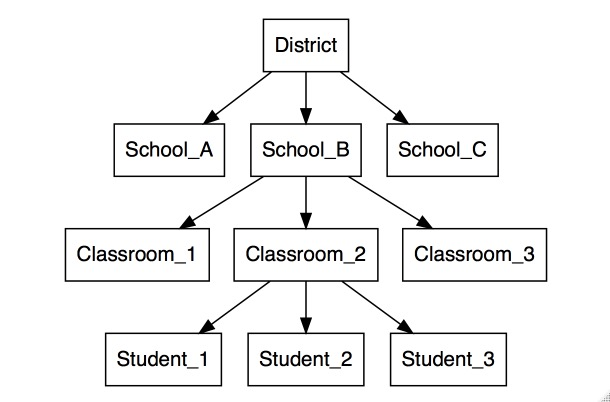

Hierarchical and mixed-effect models in R
========================================================
author: Richard Erickson
date: 1 May 2019
autosize: true
css: css/style.css
font-import: http://fonts.googleapis.com/css?family=Open+Sans
font-family: 'Open Sans'
transition: none
   
<span class="footer">
U.S. Department of the Interior<br>
U.S. Geological Survey 
</span>

About me
========================================================
title: true
incremental: true

- Research Quantitative Ecologist 
- Develop models to guide invasive species control
- *UseR* since 2007

<span class="footer">
  
</span>

Outcome
========================================================
title: true
incremental: true

- Understand basics of mixed-effect models
- Know how to use lme4's `lmer()` and `glmer()` functions
- Awareness of advanced methods

Outline
========================================================
title: true
incremental: true

- Intro (5 minutes)
- Why do we need hierarchical or mixed-effect models? (5 minutes)
- Refresher on linear models (20 minutes)
- What are hierarchical or mixed-effect? (30 minutes)
- Linear mixed-effect models with `lme4` (60 minutes)
- Generalized mixed-effect models with `lme4` (60 minutes)
- Beyond simple models: Where to go from here? (30 minutes)

<span class="footer">
  
</span>

Why do we need hierarchical models?
========================================================
title: true


<span class="footer">
  
</span>

pseudo-replication
========================================================
title: true


<span class="footer">
  
</span>


Nested data
========================================================
title: true



<span class="footer">
  
</span>


Repeated measures
========================================================
title: true


<span class="footer">
  
</span>


Linear models: Workhorse of R
========================================================
title: true


Image source: Library of Congress

<span class="footer">
  
</span>


Simple linear model
========================================================
title: true
incremental: true

- $y = ax + b$
- $y = a + b x$
- $y = m x + b$
- $y_i \sim \beta_0 + \beta_1 x_i + \epsilon_i$

<span class="footer">
  
</span>

lm() in R
========================================================
title: true
incremental: true

- `lm()`
- `forumla = `
- `data = `
- `lm(formulay ~ x, data = dat)`

<span class="footer">
  
</span>


Multiple regression
========================================================
title: true
incremental: true

- $y ~ x_1 \beta_1 +  x_2 \beta_2 + \epsilon$
- `lm(y ~ x2 + x2, data = dat)`

<span class="footer">
  
</span>


Dummy variables
========================================================
title: true
incremental: true

- Continuous (*slope*): 
  - The vector of raw data
  - `x1` = c(`-0.7024536, 1.0773152, 2.683227, -1.1911528`)
- Discrete (*intercept*):
  - `0`s and `1`s to code for membership in a group
  - `x2` = c(`0, 1, 0, 0`)
  

<span class="footer">
  
</span>

formula syntax
========================================================
title: true
incremental: true


- `formula = y ~ 1 + x1` (or shorthand `formula = y ~ x1`)
- `formula = y ~ x1 - 1`

<span class="footer">
  
</span>


Red fish, blue fish
========================================================
title: true


```r
df = data.frame(length = c(1, 2, 3), 
                fish = c("red", "blue", "red"))
print(df)
```

```
  length fish
1      1  red
2      2 blue
3      3  red
```


<span class="footer">
  
</span>

Red fish vs. blue fish
========================================================
title: true


```r
model.matrix( ~ length + fish, data = df)
```

```
  (Intercept) length fishred
1           1      1       1
2           1      2       0
3           1      3       1
attr(,"assign")
[1] 0 1 2
attr(,"contrasts")
attr(,"contrasts")$fish
[1] "contr.treatment"
```


<span class="footer">
  
</span>

Red fish and blue fish
========================================================
title: true


```r
model.matrix( ~ length + fish - 1, data = df)
```

```
  length fishblue fishred
1      1        0       1
2      2        1       0
3      3        0       1
attr(,"assign")
[1] 1 2 2
attr(,"contrasts")
attr(,"contrasts")$fish
[1] "contr.treatment"
```

<span class="footer">
  
</span>


Red fish, blue fish data
========================================================
title: true


```r
glimpse(fishes)
```

```
Observations: 20
Variables: 2
$ length <dbl> 8.792934, 10.277429, 11.084441, 7.654302, 10.429125, 10.5…
$ fish   <chr> "red", "red", "red", "red", "red", "red", "red", "red", "…
```

```r
fish_means <- fishes %>% group_by(fish) %>% summarize(mean(length))
fish_means
```

```
# A tibble: 2 x 2
  fish  `mean(length)`
  <chr>          <dbl>
1 blue            4.88
2 red             9.62
```

<span class="footer">
  
</span>


Red fish, blue fish summary
========================================================
title: true


```r
fish_summary <- fishes %>% group_by(fish) %>% summarize(mean(length))
fish_summary
```

```
# A tibble: 2 x 2
  fish  `mean(length)`
  <chr>          <dbl>
1 blue            4.88
2 red             9.62
```

<span class="footer">
  
</span>

Red fish, blue lm
========================================================
title: true


```r
fish_lm <- lm(length ~ fish - 1, data = fishes)
coef(fish_lm)
```

```
fishblue  fishred 
4.881829 9.616843 
```

```r
print(fish_summary)
```

```
# A tibble: 2 x 2
  fish  `mean(length)`
  <chr>          <dbl>
1 blue            4.88
2 red             9.62
```
<span class="footer">
  
</span>


What if nested observations?
========================================================
title: true
incremental: true

- Collapse
  - Use means by group
  - Lose variability, observations
- Ignore 
  - Treat all individuals as independent
  - Too many observations ("pseudo-replication")
- Model it! 
  
<span class="footer">
  
</span>

Linear mixed-effect models
========================================================
title: true
incremental: true

- Assume hiearcy of data 
- Shared mean of means
- Example: $y_i \sim \beta_0 + \beta_1 x_i + \epsilon_{i} + \delta_{i,j}$


<span class="footer">
  
</span>

Brief history
========================================================
title: true
incremental: true

- Paired t-test, early 1900s
- 1940s and 1950s for repeated measure ANOVAs
- LMERs and GLMERs, 1990s and 2000s

<span class="footer">
  
</span>

Schools example
========================================================
title: true


<span class="footer">
  
</span>

Terminology 
========================================================
title: true

Multiple definitions (see Gelman's blog [post](https://statmodeling.stat.columbia.edu/2005/01/25/why_i_dont_use/))

- Hierarchical models, nested models, multi-level models
- Regression framework: 
  - "Pool" information
  - "Random-effect" vs. "fixed-effect" in "mixed-effect"
  - Linear mixed-effect regression (`lmer()`)
- Repeated sampling
  - Repeated-measure
  - Paired-test
 
<span class="footer">
  
</span>


Simple eample for intercepts
========================================================
title: true


<span class="footer">
  
</span>


Fixed vs random-effect model
========================================================
title: true


<span class="footer">
  
</span>

Fixed vs random-effect model
========================================================
title: true


<span class="footer">
  
</span>


Applies to all coefficients
========================================================
title: true
incremental: true

- Random-effect intercept estiamtes
- Random-effect slope estimates 

<span class="footer">
  
</span>


Packages in R
========================================================
title: true

- Over a dozen R packages (see [here](http://glmm.wikidot.com/software) and [here](https://www.seascapemodels.org/rstats/2017/04/14/glmm-comparison.html))
- `lme4`

<span class="footer">
  
</span>

Example dataset--Sleep study
========================================================
title: true


```r
library(lme4)
library(tidyverse)
data("sleepstudy")
sleepstudy %>% glimpse()
```

```
Observations: 180
Variables: 3
$ Reaction <dbl> 249.5600, 258.7047, 250.8006, 321.4398, 356.8519, 414.6…
$ Days     <dbl> 0, 1, 2, 3, 4, 5, 6, 7, 8, 9, 0, 1, 2, 3, 4, 5, 6, 7, 8…
$ Subject  <fct> 308, 308, 308, 308, 308, 308, 308, 308, 308, 308, 309, …
```

<span class="footer">
  
</span>


Example dataset--Sleep study
========================================================
title: true


```r
ggplot(sleepstudy, aes(x = Days, y = Reaction)) +  geom_point() + 
  stat_smooth(method = 'lm', se = FALSE) + facet_wrap( . ~ Subject, nrow = 1) +  theme_minimal() 
```


<span class="footer">
  
</span>


Example dataset--Sleep study
========================================================
title: true


<span class="footer">
  
</span>


lme4 
========================================================
title: true

- `lmer()` function
- Similar to `lm()`


<span class="footer">
  
</span>


lmer() inputs
========================================================
title: true

- `formula`
- `data`
- `REML`
 - `TRUE`: Restricted maximum-likelihood 
 - `FALSE`:  Maximum-likelihood

<span class="footer">
  
</span>

lmer() formula
========================================================
title: true

- Random-intercept: `y ~ 1 + (1/group)`
- Random-intercept: `y ~ 1 + (1/group)`
- Random- and fixed-slope: `y ~ x + (x|group)`
- Correlated random intercept and slope.: `y ~ x + (x|group)`
- Uncorrelated random intercept and slope.: `y ~ x + (x||group)`

<span class="footer">
  
</span>

lmer() formula options
========================================================
title: true

<span class="footer">
  
</span>


lmer() output
========================================================
title: true

<span class="footer">
  
</span>


lmer() summary
========================================================
title: true

<span class="footer">
  
</span>


lmer() fixef
========================================================
title: true

<span class="footer">
  
</span>


lmer() randef
========================================================
title: true

<span class="footer">
  
</span>

lmer() predict
========================================================
title: true

<span class="footer">
  
</span>


Understanding outputs 
========================================================
title: true

<span class="footer">
  
</span>


Generalized linear mixed-effect regression
========================================================
title: true

<span class="footer">
  
</span>


GLMs in R
========================================================
title: true

<span class="footer">
  
</span>


glm() inputs
========================================================
title: true

<span class="footer">
  
</span>


glm() family functions 
========================================================
title: true

<span class="footer">
  
</span>

glm() link functions 
========================================================
title: true

<span class="footer">
  
</span>

glmer() 
========================================================
title: true

<span class="footer">
  
</span>

Example dataset
========================================================
title: true

<span class="footer">
  
</span>


Beyond simple models
========================================================
title: true

<span class="footer">
  
</span>


Uncertainty around "random-effects"
========================================================
title: true

<span class="footer">
  
</span>

Multiple levels within levels within levels
========================================================
title: true

<span class="footer">
  
</span>


More than regression models
========================================================
title: true

<span class="footer">
  
</span>

Tools
========================================================
title: true

<span class="footer">
  
</span>


Example with Stan
========================================================
title: true

<span class="footer">
  
</span>


My contact
========================================================
title: true

- https://www.usgs.gov/staff-profiles/richard-erickson
- https://github.com/rerickson-usgs
- rerickson@usgs.gov

<span class="footer">
  
</span>
